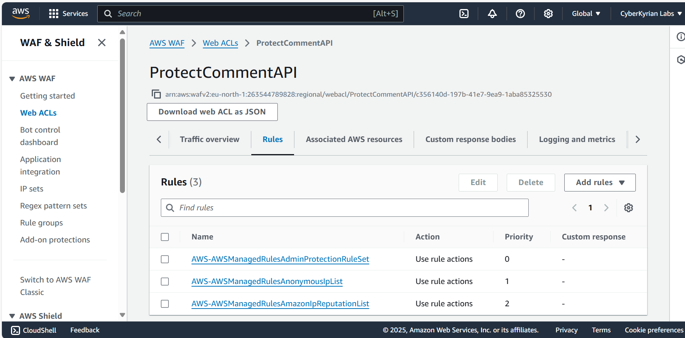

# Secure Serverless API Lab: Real-World API Hardening

### Author: Kyrian Onyeagusi
🌐 [LinkedIn](https://www.linkedin.com/in/kyrian-onyeagusi/) | 📬 [Email](mailto:cyberkyrian@gmail.com)

### Focus: Node.js Lambda API Hardening with AWS WAF, Rate Limiting, and Input Validation

---

## Tools & Skills Demonstrated

* AWS Lambda (Node.js 18.x)
* REST API Gateway
* API Key Management + Usage Plans
* AWS WAF Web ACLs
* Input Validation & Sanitization (JavaScript)
* IAM Permissions
* CloudWatch Log Analysis

---

## Lab Overview

In this project, I created and deployed an insecure public-facing Lambda API using AWS services, simulating common vulnerabilities like XSS and API spamming. I then implemented a series of security improvements including input validation, usage plan throttling, and WAF rule enforcement.

This mirrors common risks seen in production APIs and shows how to apply scalable cloud-native protections.

---

## 🖥️ Environment Setup

### Lambda Function

* Runtime: Node.js 18.x
* Function Name: `mycommentHandler`
* Permissions: IAM role with basic Lambda execution

> ✅ **Screenshot:** Lambda console showing `commentHandler` function created
> 

### HTTP API Gateway (Initial Phase)

* Triggered Lambda via HTTP API
* Route: `/mycommentHandler`
* Deployed to `prod`

> ✅ **Screenshot:** HTTP API gateway setup with insecure route
> 

---

## Simulated Vulnerabilities

### 1. No Input Validation (XSS)

**Test Input:**

```bash
curl "https://.../commentHandler?text=<script>alert('x')</script>"
```

**Risk:** Echoes raw input, exposing script tags.

> ✅ **Screenshot:** Response showing unsanitized input
> 
> 


---

### 2. No Rate Limiting (Spam)

Used a loop to send multiple requests rapidly:

```powershell
for ($i = 1; $i -le 20; $i++) {
  Invoke-WebRequest "https://.../commentHandler?text=spam$i"
}
```

> ✅ **Screenshot:** CloudWatch logs showing burst request patterns
> 

---

## Hardenings Applied

### 1. Input Sanitization

**Code Improvement:**

```js
const sanitized = input.replace(/[^a-zA-Z0-9 ]/g, '');
```

* Removed risky characters
* Prevented injection-style abuse

> ✅ **Screenshot:** Updated Lambda function with input sanitization
> 

---

### 2. API Key & Usage Plan Enforcement

**Configuration:**

* Rate: 5 req/sec, Burst: 10
* Quota: 100 requests/day

> ✅ **Screenshot:** 403 forbidden error without API key
> ✅ **Screenshot:** Success response with API key attached
> 

---

### 3. AWS WAF Integration

**Web ACL Rules Enabled:**

* AWSManagedRulesCommonRuleSet
* IP rate-based rule: 100 requests per 5 minutes

Attached Web ACL to REST API Gateway.

> ✅ **Screenshot:** WAF rule summary and metrics showing blocked traffic
> 
> 

---

## 📌 Conclusion

This lab mirrors real challenges faced by cloud security professionals when building secure APIs. I demonstrated end-to-end awareness of insecure input handling, API spamming, and misconfiguration, and applied layered mitigation techniques using AWS-native tools.

It shows my readiness to handle practical security tasks in modern cloud-native environments.

---

## 🔗 Contact

**Kyrian Onyeagusi**
🌐 [LinkedIn](https://www.linkedin.com/in/kyrian-onyeagusi/) | 📬 [Email](mailto:cyberkyrian@gmail.com) 
